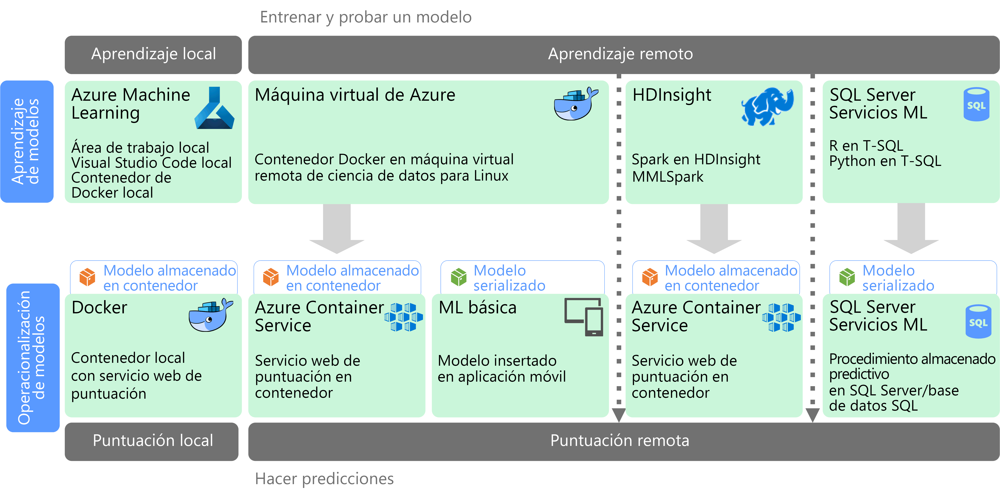

# Aprendizaje automático a escala

El aprendizaje automático es una técnica usada para entrenar modelos predictivos basados en algoritmos matemáticos. El aprendizaje automático analiza las relaciones entre los campos de datos para predecir valores desconocidos.

La creación e implementación de un modelo de aprendizaje automático es un proceso iterativo:

* Los científicos de datos exploran los datos de origen para determinar las relaciones entre las *características* y las *etiquetas* previstas.
* Los científicos de datos entrenan y validan modelos basados en algoritmos adecuados para encontrar el modelo óptimo para la predicción.
* El modelo óptimo se implementa en producción, como un servicio web u otra función encapsulada.
* A medida que se recopilan datos nuevos, se vuelve a entrenar el modelo periódicamente para mejorar su eficacia.

El aprendizaje automático a escala trata dos ámbitos de escalabilidad diferentes. La primera es el entrenamiento de un modelo con grandes conjuntos de datos, que necesita las funcionalidades de la escalabilidad horizontal de un clúster para realizar el entrenamiento. El segundo se centra en la puesta en operación del modelo entrenado de manera que se pueda escalar para cumplir las necesidades de las aplicaciones que lo consumen. Normalmente esto se consigue mediante la implementación de las funcionalidades de predicción como un servicio web que, a continuación, se puede escalar horizontalmente.

El aprendizaje automático a escala tiene la ventaja de que se pueden generar funcionalidades eficaces de predicción, ya que normalmente los mejores modelos parten de datos más extensos. Una vez que se entrena un modelo, se puede implementar como un servicio web sin estado, de alto rendimiento y con escalabilidad horizontal. 

## Preparación y entrenamiento de modelo

Durante la fase de preparación y entrenamiento del modelo, los científicos de datos exploran los datos de forma interactiva mediante lenguajes como Python y R para:

* Extraer muestras de almacenes de datos de gran volumen.
* Buscar y tratar los valores atípicos, los duplicados y los valores que faltan para limpiar los datos.
* Determinar las correlaciones y las relaciones en los datos mediante la visualización y el análisis estadístico.
* Generar nuevas características calculadas que mejoren la capacidad de predicción de las relaciones estadísticas.
* Entrenar modelos de aprendizaje automático basados en algoritmos de predicción.
* Validar modelos entrenados utilizando los datos que se han retenido durante el entrenamiento.

Para posibilitar esta fase de modelado y análisis interactivo, la plataforma de datos debe permitir a los científicos de datos explorar los datos utilizando una variedad de herramientas. Además, el entrenamiento de un modelo de entrenamiento automático complejo puede requerir una gran cantidad de procesamiento intensivo de grandes volúmenes de datos, por lo que serán esenciales los recursos suficientes para escalar horizontalmente el entrenamiento del modelo.

## Implementación y consumo del modelo

Cuando un modelo está listo para su implementación, se puede encapsular como un servicio web e implementarlo en la nube, en un dispositivo perimetral o dentro de un entorno de ejecución de aprendizaje automático empresarial. Este proceso de implementación se conoce como puesta en operación.

## Desafíos

El aprendizaje a escala automático produce algunos desafíos:

- Normalmente necesitará una gran cantidad de datos para entrenar un modelo, especialmente en modelos de aprendizaje profundo.
- Debe preparar estos conjuntos de macrodatos antes de comenzar incluso a entrenar el modelo.
- La fase de entrenamiento del modelo debe tener acceso a los almacenes de macrodatos. Es habitual realizar el entrenamiento del modelo utilizando el mismo clúster de macrodatos, por ejemplo Spark, que se usa para la preparación de los datos. 
- Para escenarios como el aprendizaje profundo, no solo necesitará un clúster que pueda proporcionar el escalado horizontal en las CPU, sino que el clúster deberá disponer de nodos de GPU habilitados.

## Aprendizaje automático a escala en Azure

Antes de decidir qué servicios de Machine Learning utilizará en el entrenamiento y puesta en operación, considere si necesita entrenar un modelo o bien si un modelo creado previamente puede satisfacer sus requisitos. En muchos casos, con un modelo creado previamente solo se trata de realizar una llamada a un servicio web o utilizar una biblioteca de aprendizaje automático para cargar un modelo existente. Entre estas opciones se incluyen: 

- Utilizar los servicios web proporcionados por Microsoft Cognitive Services.
- Utilizar los modelos de red neuronal previamente entrenados proporcionados por Cognitive Toolkit.
- Insertar los modelos serializados proporcionados por Core ML para aplicaciones de iOS. 

Si un modelo creado previamente no se ajusta a sus datos o su escenario, las opciones de Azure incluyen Azure Machine Learning, HDInsight con Spark MLlib y MMLSpark, Cognitive Toolkit y SQL Machine Learning Services. Si decide usar un modelo personalizado, debe diseñar una canalización que incluya el entrenamiento y la puesta en operación del modelo. 

Para obtener una lista de las opciones de tecnología de aprendizaje automático de Azure, consulte los temas siguientes:

- [Elección de una tecnología de servicios cognitivos](../technology-choices/cognitive-services.md)
- [Elección de una tecnología de aprendizaje automático](../technology-choices/data-science-and-machine-learning.md)
- [Elección de una tecnología de procesamiento de lenguaje natural](../technology-choices/natural-language-processing.md)
