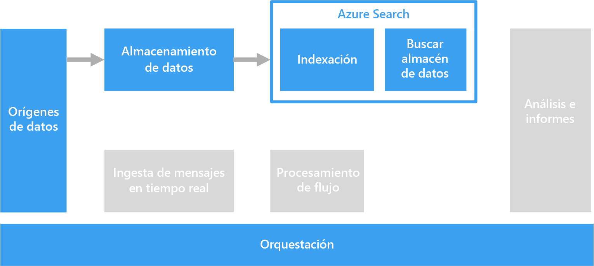

# Procesamiento de texto sin formato para búsquedasProcessing free-form text for search

Para poder realizar búsquedas, el procesamiento de texto sin formato se puede realizar en documentos que contienen párrafos de texto.To support search, free-form text processing can be performed against documents containing paragraphs of text.

La búsqueda de texto funciona mediante la creación de un índice especializado que se calcula previamente en una colección de documentos.Text search works by constructing a specialized index that is precomputed against a collection of documents. Una aplicación cliente envía una consulta que contiene los términos de búsqueda.A client application submits a query that contains the search terms. La consulta devuelve un conjunto de resultados conformado por una lista de documentos que se ordenan por el grado de coincidencia de cada documento con los criterios de búsqueda.The query returns a result set, consisting of a list of documents sorted by how well each document matches the search criteria. El conjunto de resultados también puede incluir el contexto en el que el documento cumple los criterios, lo que permite a la aplicación resaltar la frase coincidente en el documento.The result set may also include the context in which the document matches the criteria, which enables the application to highlight the matching phrase in the document. 

El procesamiento de texto sin formato puede producir datos útiles y procesables a partir de grandes cantidades de datos de texto farragosos.Free-form text processing can produce useful, actionable data from large amounts of noisy text data. Los resultados pueden dotar a documentos no estructurados de una estructura bien definida y consultable.The results can give unstructured documents a well-defined and queryable structure.

## DesafíosChallenges

- El procesamiento de una colección de documentos de texto sin formato suele consumir muchos recursos de cálculo y también una gran cantidad de tiempo.Processing a collection of free-form text documents is typically computationally intensive, as well as time intensive.
- Para buscar texto sin formato de forma eficaz, el índice de búsqueda debe admitir la búsqueda aproximada basándose en términos que tengan una construcción similar.In order to search free-form text effectively, the search index should support fuzzy search based on terms that have a similar construction. Por ejemplo, los índices de búsqueda se crean con lematización, de forma que las consultas de "ejecutar" encuentren documentos que contengan "ejecutó" y "ejecución".For example, search indexes are built with lemmatization and linguistic stemming, so that queries for "run" will match documents that contain "ran" and "running."

## ArchitectureArchitecture

En la mayoría de los casos, los documentos de texto de origen se cargan en un servicio de almacenamiento de objetos, como Azure Storage o Azure Data Lake Store.In most scenarios, the source text documents are loaded into object storage such as Azure Storage or Azure Data Lake Store. Una excepción es la realización de una búsqueda de texto completo en SQL Server o Azure SQL Database.An exception is using full text search within SQL Server or Azure SQL Database. En este caso, los datos del documento se cargan en tablas administradas por la base de datos.In this case, the document data is loaded into tables managed by the database. Una vez almacenados, los documentos se procesan en un lote para crear el índice.Once stored, the documents are processed in a batch to create the index.

## Opciones de tecnologíaTechnology choices

Entre las opciones para crear un índice de búsqueda se incluyen Azure Search, Elasticsearch y HDInsight con Solr.Options for creating a search index include Azure Search, Elasticsearch, and HDInsight with Solr. Cada una de estas tecnologías puede completar un índice de búsqueda a partir de una colección de documentos.Each of these technologies can populate a search index from a collection of documents. Azure Search proporciona indizadores que pueden rellenar automáticamente el índice para documentos de texto sin formato o con formato Excel y PDF.Azure Search provides indexers that can automatically populate the index for documents ranging from plain text to Excel and PDF formats. En HDInsight, Apache Solr puede indexar archivos binarios de muchos tipos, incluidos documentos de texto sin formato, Word y PDF.On HDInsight, Apache Solr can index binary files of many types, including plain text, Word, and PDF. Una vez que se crea el índice, los clientes pueden acceder a la interfaz de búsqueda por medio de una API REST.Once the index is constructed, clients can access the search interface by means of a REST API. 

Si los datos de texto se almacenan en SQL Server o Azure SQL Database, puede usar la búsqueda de texto completo integrada en la base de datos.If your text data is stored in SQL Server or Azure SQL Database, you can use the full-text search that is built into the database. La base de datos rellena el índice a partir de datos de texto, binarios o XML almacenados en la misma base de datos.The database populates the index from text, binary, or XML data stored within the same database. Los clientes realizan búsquedas mediante consultas T-SQL.Clients search by using T-SQL queries. 

Para más información, consulte los [Buscar almacenes de datos](../technology-choices/search-options.md).For more information, see [Search data stores](../technology-choices/search-options.md).
