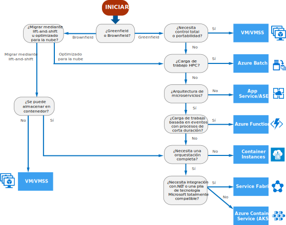

# Árbol de decisión para los servicios de proceso de Azure

Azure ofrece una serie de formas de hospedar el código de aplicación. El término *proceso* hace referencia al modelo de hospedaje para los recursos informáticos donde se ejecutan las aplicaciones. El diagrama de flujo siguiente le ayudará a elegir un servicio de proceso para la aplicación. El diagrama de flujo le guía a través de un conjunto de criterios de decisión clave para alcanzar una recomendación. 

**Tratar este diagrama de flujo como un punto de partida.** Cada aplicación tiene requisitos únicos, por lo que debe usar la recomendación como un punto de partida. A partir de ahí, realice una evaluación más detallada y examine aspectos como:
 
- Conjunto de características
- [Límites de servicio](/azure/azure-subscription-service-limits)
- [Costee](https://azure.microsoft.com/pricing/)
- [Acuerdo de Nivel de Servicio](https://azure.microsoft.com/support/legal/sla/)
- [Disponibilidad regional](https://azure.microsoft.com/global-infrastructure/services/)
- Ecosistema del desarrollador y habilidades del equipo
- [Tablas de comparación de procesos](./compute-comparison.md)

Si la aplicación consta de varias cargas de trabajo, evalúe cada carga de trabajo por separado. Una solución completa puede incluir dos o más servicios de proceso.

