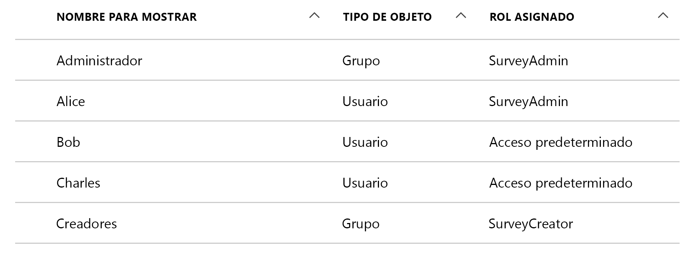
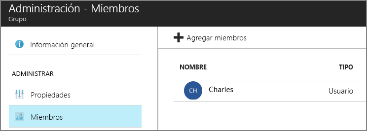

# <a name="application-roles"></a>Roles de la aplicación

[ Código de ejemplo][sample application]

Los roles de aplicación se usan para asignar permisos a usuarios. Por ejemplo, la aplicación [Surveys de Tailspin][Tailspin] define los siguientes roles:

* Administrador. Puede realizar todas las operaciones CRUD en cualquier encuesta que pertenezca a ese inquilino.
* Creador. Puede crear nuevas encuestas.
* Lector. Puede leer cualquier encuesta que pertenezca a ese inquilino.

Puede ver que los roles finalmente se traducen en permisos durante la [autorización]. Pero la primera pregunta es cómo asignar y administrar roles. Identificamos tres opciones principales:

* [Roles de aplicación de Azure AD](#roles-using-azure-ad-app-roles)
* [Grupos de seguridad de Azure AD](#roles-using-azure-ad-security-groups)
* [Administrador de roles de aplicación](#roles-using-an-application-role-manager).

## <a name="roles-using-azure-ad-app-roles"></a>Roles que usan roles de aplicación de Azure AD
Este es el enfoque que utilizamos en la aplicación Tailspin Surveys.

En este enfoque, el proveedor SaaS define los roles de aplicación agregándolos al manifiesto de aplicación. Después de que un cliente se suscriba, un administrador del directorio de AD del cliente asigna usuarios a los roles. Cuando un usuario inicia sesión, los roles asignados del usuario se envían como notificaciones.

> [!NOTE]
> Si el cliente tiene Azure AD Premium, el administrador puede asignar un grupo de seguridad a un rol y los miembros del grupo heredarán el rol de aplicación. Esto es una forma cómoda de administrar roles, porque el propietario del grupo no necesita ser un administrador de AD.
> 
> 

Ventajas de este enfoque:

* Modelo de programación simple.
* Los roles son específicos de la aplicación. Las notificaciones de rol para una aplicación no se envían a otra aplicación.
* Si el cliente quita la aplicación de su inquilino de AD, los roles desaparecen.
* La aplicación no necesita ningún permiso adicional de Active Directory que no sea el de lectura del perfil del usuario.

Inconvenientes:

* Los clientes que no tienen Azure AD Premium no pueden asignar grupos de seguridad a roles. Para estos clientes, todas las asignaciones de usuario las debe llevar a cabo un administrador de AD.
* Si tiene una API web back-end, que es independiente de la aplicación web, las asignaciones de roles de la aplicación web no se aplican entonces a la API web. Para más información sobre este punto, consulte [Securing a backend web API] (Protección de una API web back-end).

### <a name="implementation"></a>Implementación
**Definir los roles.** El proveedor de SaaS declara los roles de aplicación en el [manifiesto de aplicación]. Por ejemplo, a continuación se muestra la entrada de manifiesto de la aplicación Surveys:

```json
"appRoles": [
  {
    "allowedMemberTypes": [
      "User"
    ],
    "description": "Creators can create Surveys",
    "displayName": "SurveyCreator",
    "id": "1b4f816e-5eaf-48b9-8613-7923830595ad",
    "isEnabled": true,
    "value": "SurveyCreator"
  },
  {
    "allowedMemberTypes": [
      "User"
    ],
    "description": "Administrators can manage the Surveys in their tenant",
    "displayName": "SurveyAdmin",
    "id": "c20e145e-5459-4a6c-a074-b942bbd4cfe1",
    "isEnabled": true,
    "value": "SurveyAdmin"
  }
],
```

La propiedad `value` aparece en la notificación de rol. La propiedad `id` es el identificador único para el rol definido. Siempre genera un nuevo valor GUID para `id`.

**Asignar usuarios**. Cuando se suscribe un nuevo cliente, la aplicación se registra en el inquilino de AD del cliente. En este punto, un administrador de AD para ese inquilino puede asignar usuarios a roles.

> [!NOTE]
> Como se señaló anteriormente, los clientes con Azure AD Premium también pueden asignar grupos de seguridad a los roles.
> 
> 

En la siguiente captura de pantalla de Azure Portal se muestran los usuarios y grupos de la aplicación Survey. Admin y Creator son grupos, que se asignan a los roles SurveyAdmin y SurveyCreator, respectivamente. Alice es un usuario que se asignó directamente al rol SurveyAdmin. Bob y Charles son usuarios que no se han asignado directamente a un rol.



Tal y como se muestra en la siguiente captura de pantalla, Charles forma parte del grupo Admin, por lo que hereda el rol SurveyAdmin. En el caso de Bob, aún no se le ha asignado un rol.




> [!NOTE]
> Un enfoque alternativo para la aplicación es asignar roles mediante programación, con Graph API de Azure AD. Sin embargo, esto requiere que la aplicación obtenga permisos de escritura para el directorio de AD del cliente. Una aplicación con esos permisos podría hacer muchas travesuras &mdash; el cliente confía en que la aplicación no arruine su directorio. Muchos clientes pueden no estar dispuestos a conceder este nivel de acceso.
> 

**Obtener notificaciones de rol**. Cuando un usuario inicia sesión, la aplicación recibe los roles asignados del usuario en una notificación con el tipo `http://schemas.microsoft.com/ws/2008/06/identity/claims/role`.  

Un usuario puede tener varios roles o ningún rol. En el código de autorización, no suponga que el usuario tiene exactamente un rol de notificación. En su lugar, escriba el código que comprueba si hay un valor de notificación determinado:

```csharp
if (context.User.HasClaim(ClaimTypes.Role, "Admin")) { ... }
```

## <a name="roles-using-azure-ad-security-groups"></a>Roles que usan grupos de seguridad de Azure AD
En este enfoque, los roles se representan como grupos de seguridad de AD. La aplicación asigna permisos a los usuarios según la pertenencia de estos a grupos de seguridad.

Ventajas:

* Para los clientes que no tienen Azure AD Premium, este enfoque les permite utilizar grupos de seguridad para administrar las asignaciones de roles.

Desventajas:

* Complejidad. Dado que cada inquilino envía notificaciones de grupo diferentes, la aplicación debe realizar un seguimiento de qué grupos de seguridad corresponden a qué roles de aplicación para cada inquilino.
* Si el cliente quita la aplicación de su inquilino de AD, los grupos de seguridad se mantienen en su directorio de AD.

### <a name="implementation"></a>Implementación
En el manifiesto de aplicación, establezca la propiedad `groupMembershipClaims` en "SecurityGroup". Esto es necesario para obtener notificaciones de pertenencia a grupo de AAD.

```json
{
   // ...
   "groupMembershipClaims": "SecurityGroup",
}
```

Cuando un nuevo cliente se suscribe, la aplicación indica al cliente que cree grupos de seguridad para los roles que necesita la aplicación. A continuación, el cliente necesita escribir los identificadores de objeto de grupo en la aplicación. La aplicación almacena esto en una tabla que asigna identificadores de grupo a roles de la aplicación por inquilino.

> [!NOTE]
> Como alternativa, la aplicación podría crear los grupos mediante programación usando Graph API de Azure AD.  Esto sería menos propenso a errores. Sin embargo, ello requiere que la aplicación obtenga permisos de "lectura y escritura en todos los grupos" para el directorio de AD del cliente. Muchos clientes pueden no estar dispuestos a conceder este nivel de acceso.
> 
> 

Cuando un usuario inicia sesión:

1. La aplicación recibe los grupos del usuario como notificaciones. El valor de cada notificación es el identificador de objeto de un grupo.
2. Azure AD limita el número de grupos enviados en el token. Si el número de grupos supera este límite, Azure AD envía una notificación especial que indica que se está por encima del límite. Si esa notificación está presente, la aplicación debe consultar Graph API de Azure AD para obtener todos los grupos a los que pertenece ese usuario. Para más información, consulte Authorization in Cloud Applications using AD Groups [Autorización de aplicaciones en la nube mediante grupos de AD], en la sección titulada "Groups claim overage" (Exceso de notificaciones de grupos).
3. La aplicación busca los identificadores de objeto en su propia base de datos, para encontrar los roles de aplicación correspondientes para asignar al usuario.
4. La aplicación agrega un valor de notificación personalizado a la entidad de seguridad del usuario que expresa el rol de aplicación. Por ejemplo: `survey_role` = "SurveyAdmin".

Las directivas de autorización deben usar la notificación de rol personalizada, no la notificación de grupo.

## <a name="roles-using-an-application-role-manager"></a>Roles que usan un administrador de roles de aplicación
Con este enfoque, los roles de aplicación no se almacenan en Azure AD en absoluto. En su lugar, la aplicación almacena las asignaciones de roles para cada usuario en su propia base de datos &mdash; por ejemplo, mediante la clase **RoleManager** en ASP.NET Identity.

Ventajas:

* La aplicación tiene control total sobre los roles y asignaciones de usuario.

Inconvenientes:

* Más complejo, es más difícil de mantener.
* No se pueden usar grupos de seguridad de AD para administrar asignaciones de roles.
* Almacena la información del usuario en la base de datos de la aplicación, donde puede perder la sincronización con el directorio de AD del inquilino a medida que se agregan o quitan usuarios.   


[**Siguiente**][autorización]

<!-- Links -->
[Tailspin]: tailspin.md

[autorización]: authorize.md
[Securing a backend web API]: web-api.md
[manifiesto de aplicación]: /azure/active-directory/active-directory-application-manifest/
[sample application]: https://github.com/mspnp/multitenant-saas-guidance
