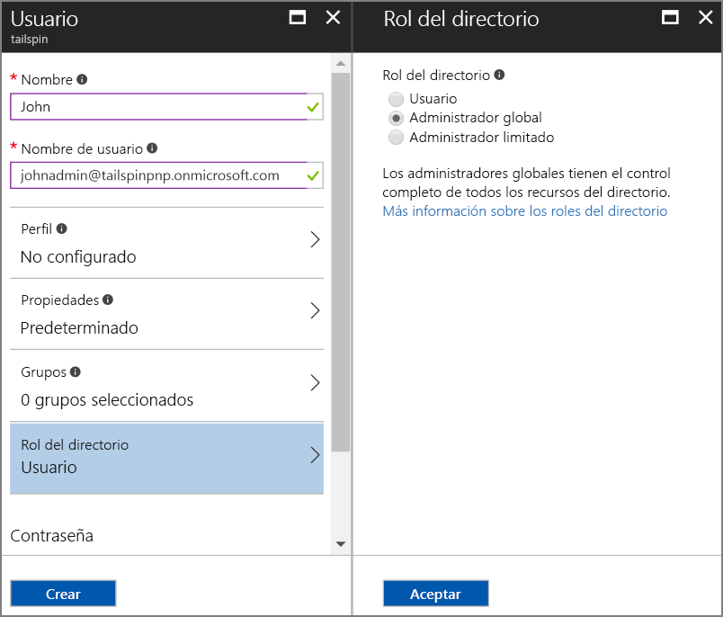
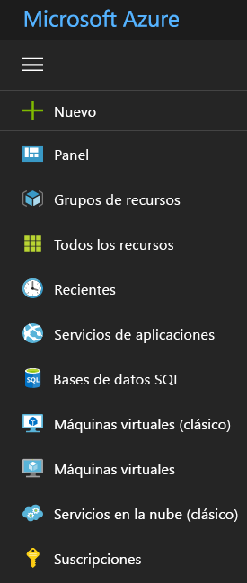

# <a name="use-azure-key-vault-to-protect-application-secrets"></a>Uso de Azure Key Vault para proteger los secretos de la aplicación

[ Código de ejemplo][sample application]

Es habitual tener opciones de configuración de la aplicación que son confidenciales y deben protegerse, por ejemplo:

* Cadenas de conexión de base de datos
* Contraseñas
* Claves de cifrado

Como procedimiento recomendado de seguridad, no debe almacenar nunca estos secretos en el control de código fuente. Es muy fácil que se filtren, incluso si el repositorio de código fuente es privado. Y no se trata solo de proteger los secretos frente al público general. En proyectos de mayor tamaño, es posible que desee restringir qué desarrolladores y operadores pueden tener acceso a los secretos de producción. (La configuración de los entornos de prueba o desarrollo son diferentes).

Una opción más segura consiste en almacenar estos secretos en [Azure Key Vault][KeyVault]. Key Vault es un servicio hospedado en la nube para administrar claves criptográficas y otros secretos. Este artículo muestra cómo usar Key Vault para almacenar las opciones de configuración de la aplicación.

En la aplicación [Tailspin Surveys][Surveys], los siguientes parámetros de configuración son secretos:

* La cadena de conexión de base de datos.
* La cadena de conexión de Redis.
* El secreto de cliente de la aplicación web.

La aplicación Surveys carga las opciones de configuración desde las siguientes ubicaciones:

* El archivo appsettings.json
* El [almacén de secretos del usuario][user-secrets] (solo entorno de desarrollo; para pruebas)
* El entorno de hospedaje (configuración de la aplicación en aplicaciones web de Azure)
* Key Vault (cuando está habilitado)

Cada uno de estos invalida al anterior, por lo que la configuración almacenada en Key Vault tiene prioridad.

> [!NOTE]
> De forma predeterminada, el proveedor de configuración de Key Vault está deshabilitado. No es necesario para ejecutar la aplicación localmente. Lo habilitará en una implementación de producción.

En el inicio, la aplicación lee la configuración de cada proveedor de configuración registrado y los usa para rellenar un objeto de opciones fuertemente tipado. Para obtener más información, consulte [Using Options and configuration objects][options] (Uso de opciones y objetos de configuración).

## <a name="setting-up-key-vault-in-the-surveys-app"></a>Configuración de Key Vault en la aplicación Surveys
Requisitos previos:

* Instale los [cmdlets de Azure Resource Manager][azure-rm-cmdlets].
* Configure la aplicación Surveys, tal y como se describe en [Run the Surveys application][readme] (Ejecución de la aplicación Surveys).

Pasos generales:

1. Configurar un usuario administrador en el inquilino.
2. Configurar un certificado de cliente.
3. Cree un almacén de claves.
4. Agregar las opciones de configuración al almacén de claves.
5. Quitar las marcas de comentarios del código que habilita el almacén de claves.
6. Actualizar los secretos de usuario de la aplicación.

### <a name="set-up-an-admin-user"></a>Configuración de un usuario administrador
> [!NOTE]
> Para crear un almacén de claves, debe usar una cuenta que pueda administrar su suscripción de Azure. Además, cualquier aplicación que autorice a leer desde el almacén de claves debe registrarse en el mismo inquilino que esa cuenta.
> 
> 

Con esto, se asegura de que pueda crear un almacén de claves mientras tiene una sesión iniciada como un usuario del inquilino donde está registrada la aplicación Surveys.

Cree un usuario administrador en el inquilino de Azure AD donde está registrada la aplicación Surveys.

1. Inicie sesión en [Azure Portal][azure-portal].
2. Seleccione el inquilino de Azure AD donde está registrada la aplicación.
3. Haga clic en **Más servicios** > **SEGURIDAD E IDENTIDAD** > **Azure Active Directory** > **Grupos y usuario** > **Todos los usuarios**.
4. En la parte superior del portal, haga clic en **Nuevo usuario**.
5. Rellene los campos y asigne al usuario el rol de directorio **Administrador global**.
6. Haga clic en **Create**(Crear).



Ahora asigne este usuario como propietario de la suscripción.

1. En el menú de concentrador, seleccione **Suscripción**.

    

2. Seleccione la suscripción a la que desea que acceda el administrador.
3. En la hoja de suscripción, seleccione **Control de acceso (IAM)**.
4. Haga clic en **Agregar**.
4. En **Rol**, seleccione **Propietario**.
5. Escriba la dirección de correo electrónico del usuario al que desea agregar como propietario.
6. Seleccione al usuario y haga clic en **Guardar**.

### <a name="set-up-a-client-certificate"></a>Configuración de un certificado de cliente
1. Ejecute el script de PowerShell [/Scripts/Setup-KeyVault.ps1][Setup-KeyVault] del modo siguiente:
   
    ```
    .\Setup-KeyVault.ps1 -Subject <<subject>>
    ```
    Para el parámetro `Subject` , escriba cualquier nombre, como "surveysapp". El script genera un certificado autofirmado y lo almacena en el almacén de certificados "usuario actual/Personal". La salida del script es un fragmento de código JSON. Copie este valor.

2. En [Azure Portal][azure-portal], cambie al directorio donde se registra la aplicación Surveys, seleccionando la cuenta en la esquina superior derecha del portal.

3. Seleccione **Azure Active Directory** > **Registros de aplicaciones** > Surveys.

4.  Haga clic en **Manifiesto** y, a continuación, en **Editar**.

5.  Pegue la salida del script en la propiedad `keyCredentials` . El archivo debe tener un aspecto similar al siguiente:
        
    ```json
    "keyCredentials": [
        {
        "type": "AsymmetricX509Cert",
        "usage": "Verify",
        "keyId": "29d4f7db-0539-455e-b708-....",
        "customKeyIdentifier": "ZEPpP/+KJe2fVDBNaPNOTDoJMac=",
        "value": "MIIDAjCCAeqgAwIBAgIQFxeRiU59eL.....
        }
    ],
    ```          

6. Haga clic en **Save**(Guardar).  

7. Repita los pasos de 3 a 6 para agregar el mismo fragmento de código JSON al manifiesto de la aplicación de API web (Surveys.WebAPI).

8. En la ventana de PowerShell, ejecute el siguiente comando para obtener la huella digital del certificado.
   
    ```
    certutil -store -user my [subject]
    ```
    
    Para `[subject]`, use el valor que especificó para Subject en el script de PowerShell. La huella digital se muestra en "Cert hash (SHA1)". Copie este valor. Más adelante usará la huella digital.

### <a name="create-a-key-vault"></a>Creación de un Almacén de claves
1. Ejecute el script de PowerShell [/Scripts/Setup-KeyVault.ps1][Setup-KeyVault] del modo siguiente:
   
    ```
    .\Setup-KeyVault.ps1 -KeyVaultName <<key vault name>> -ResourceGroupName <<resource group name>> -Location <<location>>
    ```
   
    Cuando se le pidan las credenciales, inicie sesión como el usuario de Azure AD que creó anteriormente. El script crea un nuevo grupo de recursos y un nuevo almacén de claves dentro de ese grupo de recursos. 
   
2. Ejecute SetupKeyVault.ps de nuevo como sigue:
   
    ```
    .\Setup-KeyVault.ps1 -KeyVaultName <<key vault name>> -ApplicationIds @("<<Surveys app id>>", "<<Surveys.WebAPI app ID>>")
    ```
   
    Establezca los siguientes valores de parámetro:
   
       * nombre de almacén de claves = el nombre que asignó al almacén de claves en el paso anterior.
       * Surveys app ID = el identificador de aplicación para la aplicación web Surveys.
       * Surveys.WebApi app ID = el identificador de aplicación para la aplicación Surveys.WebAPI.
         
    Ejemplo:
     
    ```
     .\Setup-KeyVault.ps1 -KeyVaultName tailspinkv -ApplicationIds @("f84df9d1-91cc-4603-b662-302db51f1031", "8871a4c2-2a23-4650-8b46-0625ff3928a6")
    ```
    
    Este script autoriza a la aplicación web y a la API web a recuperar los secretos de su almacén de claves. Para obtener más información, consulte [Introducción a Azure Key Vault](/azure/key-vault/key-vault-get-started/).

### <a name="add-configuration-settings-to-your-key-vault"></a>Adición de opciones de configuración al almacén de claves.
1. Ejecute SetupKeyVault.ps como sigue:
   
    ```
    .\Setup-KeyVault.ps1 -KeyVaultName <<key vault name> -KeyName Redis--Configuration -KeyValue "<<Redis DNS name>>.redis.cache.windows.net,password=<<Redis access key>>,ssl=true" 
    ```
    donde
   
   * nombre de almacén de claves = el nombre que asignó al almacén de claves en el paso anterior.
   * Nombre DNS de Redis = nombre de DNS de la instancia de caché Redis.
   * Clave de acceso de Redis = clave de acceso para la instancia de caché Redis.
     
2. En este punto, es una buena idea comprobar si se guardaron correctamente los secretos en el almacén de claves. Ejecute el siguiente comando de PowerShell:
   
    ```
    Get-AzureKeyVaultSecret <<key vault name>> Redis--Configuration | Select-Object *
    ```

3. Ejecute SetupKeyVault.ps de nuevo para agregar la cadena de conexión de base de datos:
   
    ```
    .\Setup-KeyVault.ps1 -KeyVaultName <<key vault name> -KeyName Data--SurveysConnectionString -KeyValue <<DB connection string>> -ConfigName "Data:SurveysConnectionString"
    ```
   
    donde `<<DB connection string>>` es el valor de la cadena de conexión de base de datos.
   
    Para las pruebas con la base de datos local, copie la cadena de conexión del archivo Tailspin.Surveys.Web/appsettings.json. Si lo hace, no olvide cambiar la doble barra diagonal inversa ("\\\\") por una única barra diagonal inversa. La doble barra diagonal inversa es un carácter de escape en el archivo JSON.
   
    Ejemplo:
   
    ```
    .\Setup-KeyVault.ps1 -KeyVaultName mykeyvault -KeyName Data--SurveysConnectionString -KeyValue "Server=(localdb)\MSSQLLocalDB;Database=Tailspin.SurveysDB;Trusted_Connection=True;MultipleActiveResultSets=true" 
    ```

### <a name="uncomment-the-code-that-enables-key-vault"></a>Quitar las marcas de comentarios del código que habilita el almacén de claves
1. Abra la solución Tailspin.Surveys.
2. En Tailspin.Surveys.Web/Startup.cs, busque el siguiente bloque de código y quite los comentarios.
   
    ```csharp
    //var config = builder.Build();
    //builder.AddAzureKeyVault(
    //    $"https://{config["KeyVault:Name"]}.vault.azure.net/",
    //    config["AzureAd:ClientId"],
    //    config["AzureAd:ClientSecret"]);
    ```
3. En Tailspin.Surveys.Web/Startup.cs, busque el código que registra `ICredentialService`. Quite los comentarios de la línea que usa `CertificateCredentialService`, y convierta en comentario la línea que usa `ClientCredentialService`:
   
    ```csharp
    // Uncomment this:
    services.AddSingleton<ICredentialService, CertificateCredentialService>();
    // Comment out this:
    //services.AddSingleton<ICredentialService, ClientCredentialService>();
    ```
   
    Este cambio permite que la aplicación web use la [aserción de cliente][client-assertion] para obtener tokens de acceso de OAuth. Con las aserciones de cliente, no es necesario un secreto de cliente de OAuth. También puede almacenar el secreto del cliente en el almacén de claves. Sin embargo, ambos usan un certificado de cliente por lo que, si habilita el almacén de claves, es recomendable habilitar también la aserción de cliente.

### <a name="update-the-user-secrets"></a>Actualización de los secretos del usuario
En el Explorador de soluciones, haga clic con el botón derecho en el proyecto Tailspin.Surveys.Web y seleccione **Administrar secretos de usuario**. En el archivo secrets.json, elimine el código JSON existente y pegue lo siguiente:

    ```
    {
      "AzureAd": {
        "ClientId": "[Surveys web app client ID]",
        "ClientSecret": "[Surveys web app client secret]",
        "PostLogoutRedirectUri": "https://localhost:44300/",
        "WebApiResourceId": "[App ID URI of your Surveys.WebAPI application]",
        "Asymmetric": {
          "CertificateThumbprint": "[certificate thumbprint. Example: 105b2ff3bc842c53582661716db1b7cdc6b43ec9]",
          "StoreName": "My",
          "StoreLocation": "CurrentUser",
          "ValidationRequired": "false"
        }
      },
      "KeyVault": {
        "Name": "[key vault name]"
      }
    }
    ```

Reemplace las entradas entre [corchetes] por los valores correctos.

* `AzureAd:ClientId`: identificador de cliente de la aplicación Surveys.
* `AzureAd:ClientSecret`: la clave que generó al registrar la aplicación Surveys en Azure AD.
* `AzureAd:WebApiResourceId`: URI del identificador de aplicación que especificó cuando creó la aplicación Surveys.WebAPI en Azure AD.
* `Asymmetric:CertificateThumbprint`: huella digital del certificado que obtuvo anteriormente, cuando creó el certificado de cliente.
* `KeyVault:Name`: nombre de su almacén de claves.

> [!NOTE]
> `Asymmetric:ValidationRequired` es false porque el certificado que creó anteriormente no estaba firmado por una entidad de certificación raíz. En producción, use un certificado firmado por una entidad de certificación raíz y establezca `ValidationRequired` en true.
> 
> 

Guarde el archivo actualizado secrets.json.

Después, en el Explorador de soluciones, haga clic con el botón derecho en el proyecto Tailspin.Surveys.WebApi y seleccione **Administrar secretos de usuario**. Elimine el código JSON existente y pegue lo siguiente:

```
{
  "AzureAd": {
    "ClientId": "[Surveys.WebAPI client ID]",
    "WebApiResourceId": "https://tailspin5.onmicrosoft.com/surveys.webapi",
    "Asymmetric": {
      "CertificateThumbprint": "[certificate thumbprint]",
      "StoreName": "My",
      "StoreLocation": "CurrentUser",
      "ValidationRequired": "false"
    }
  },
  "KeyVault": {
    "Name": "[key vault name]"
  }
}
```

Reemplace las entradas entre [corchetes] y guarde el archivo secrets.json.

> [!NOTE]
> Para la API web, asegúrese de usar el identificador de cliente para la aplicación Surveys.WebAPI, no la aplicación Surveys.
> 
> 

[**Siguiente**][adfs]

<!-- Links -->
[adfs]: ./adfs.md
[authorize-app]: /azure/key-vault/key-vault-get-started//#authorize
[azure-portal]: https://portal.azure.com
[azure-rm-cmdlets]: https://msdn.microsoft.com/library/mt125356.aspx
[client-assertion]: client-assertion.md
[configuration]: /aspnet/core/fundamentals/configuration
[KeyVault]: https://azure.microsoft.com/services/key-vault/
[key-tags]: https://msdn.microsoft.com/library/azure/dn903623.aspx#BKMK_Keytags
[Microsoft.Azure.KeyVault]: https://www.nuget.org/packages/Microsoft.Azure.KeyVault/
[options]: /aspnet/core/fundamentals/configuration#using-options-and-configuration-objects
[readme]: ./run-the-app.md
[Setup-KeyVault]: https://github.com/mspnp/multitenant-saas-guidance/blob/master/scripts/Setup-KeyVault.ps1
[Surveys]: tailspin.md
[user-secrets]: http://go.microsoft.com/fwlink/?LinkID=532709
[sample application]: https://github.com/mspnp/multitenant-saas-guidance
